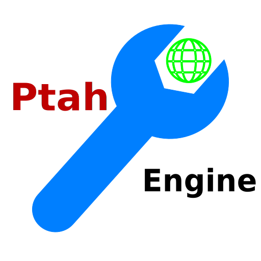

# Ptah Engine | 普塔引擎

普塔引擎（Ptah Engine）是Godot Engine的派生。旨在优化用户体验（尤其是企业用户与中文用户的体验），使任何人都可以随心所欲地在普塔中创造。

## 路线图

我们将会进行以下工作：

- [ ] 全面汉化
- [ ] 使用xmake而不是CMake
- [ ] 支持正在开发阶段的ZSharp与Leibniz框架
- [ ] 支持零代码编程
- [ ] 在各环节进行优化，提升性能
- [ ] 必要时重构部分模块
- [ ] 支持在游戏中使用高性能Web应用控件
- [ ] 支持.NET8与.NET9
- [ ] 支持LLJIT

## 2D and 3D cross-platform game engine

**[Godot Engine](https://godotengine.org) is a feature-packed, cross-platform
game engine to create 2D and 3D games from a unified interface.** It provides a
comprehensive set of [common tools](https://godotengine.org/features), so that
users can focus on making games without having to reinvent the wheel. Games can
be exported with one click to a number of platforms, including the major desktop
platforms (Linux, macOS, Windows), mobile platforms (Android, iOS), as well as
Web-based platforms and [consoles](https://docs.godotengine.org/en/latest/tutorials/platform/consoles.html).

## Free, open source and community-driven

Godot is completely free and open source under the very permissive [MIT license](https://godotengine.org/license).
No strings attached, no royalties, nothing. The users' games are theirs, down
to the last line of engine code. Godot's development is fully independent and
community-driven, empowering users to help shape their engine to match their
expectations. It is supported by the [Godot Foundation](https://godot.foundation/)
not-for-profit.

Before being open sourced in [February 2014](https://github.com/godotengine/godot/commit/0b806ee0fc9097fa7bda7ac0109191c9c5e0a1ac),
Godot had been developed by [Juan Linietsky](https://github.com/reduz) and
[Ariel Manzur](https://github.com/punto-) (both still maintaining the project)
for several years as an in-house engine, used to publish several work-for-hire
titles.

## Getting the engine

### Binary downloads

Official binaries for the Godot editor and the export templates can be found
[on the Godot website](https://godotengine.org/download).

### Compiling from source

[See the official docs](https://docs.godotengine.org/en/latest/contributing/development/compiling)
for compilation instructions for every supported platform.

## Community and contributing

Godot is not only an engine but an ever-growing community of users and engine
developers. The main community channels are listed [on the homepage](https://godotengine.org/community).

The best way to get in touch with the core engine developers is to join the
[Godot Contributors Chat](https://chat.godotengine.org).

To get started contributing to the project, see the [contributing guide](CONTRIBUTING.md).
This document also includes guidelines for reporting bugs.

## Documentation and demos

The official documentation is hosted on [Read the Docs](https://docs.godotengine.org).
It is maintained by the Godot community in its own [GitHub repository](https://github.com/godotengine/godot-docs).

The [class reference](https://docs.godotengine.org/en/latest/classes/)
is also accessible from the Godot editor.

We also maintain official demos in their own [GitHub repository](https://github.com/godotengine/godot-demo-projects)
as well as a list of [awesome Godot community resources](https://github.com/godotengine/awesome-godot).

There are also a number of other
[learning resources](https://docs.godotengine.org/en/latest/community/tutorials.html)
provided by the community, such as text and video tutorials, demos, etc.
Consult the [community channels](https://godotengine.org/community)
for more information.
